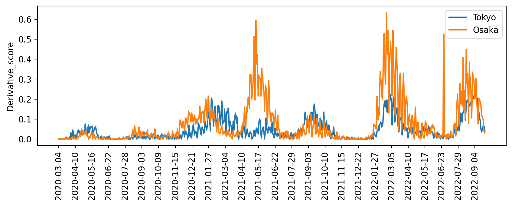
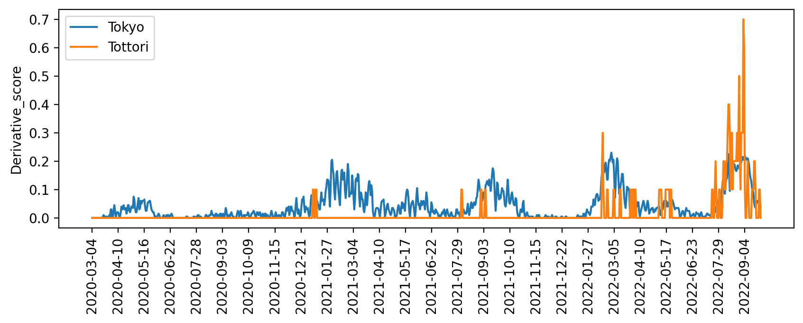
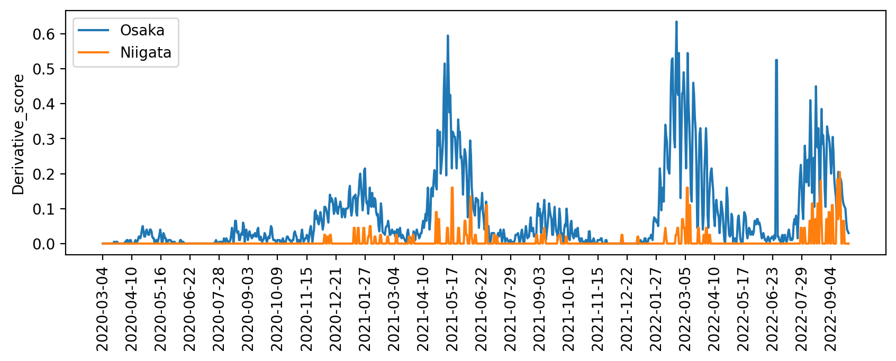
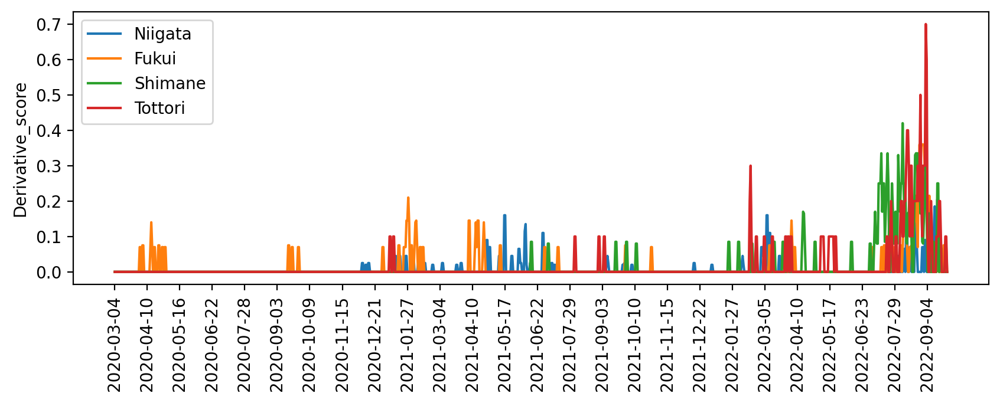

# jpcovid_v2

jpcovid_v2の目的は政策提案者の失敗を特定することです。

jpcovid_v2はcovid-19による各都道府県の死者数の総計をその国の人口で割ったスコアを時系列でグラフにし、そのスコアのグラフの傾きを示したものです。

そのスコアのグラフは連続値で単調増加関数です。そのため、急激にグラフが増加しているところで政策提案者が間違いを犯していることとなります。

したがって、このグラフの微分(傾き)を取れば、政策提案者の間違いをより明確に表すことができると考えました。

出力されたグラフの値が高いところほど、政策提案者はより深刻な間違いを犯していると考えることができます。

jpcovid_v2 は、インターネットを介して次のサイトから最新のデータをスクレイピングします。

https://www3.nhk.or.jp/n-data/opendata/coronavirus/nhk_news_covid19_prefectures_daily_data.csv

# jpcovid_v2のインストール方
$ pip install jpcovid_v2

# jpcovid_v2の実行方法
$ jpcovid_v2 <都道府県名>

$ jpcovid_v2 Tokyo Osaka

$ jpcovid_v2 Tokyo Tottori

$ jpcovid_v2 Osaka Niigata

$ jpcovid_v2 Hokkaido Nara

$ jpcovid_v2 Niigata Fukui Shimane Tottori

